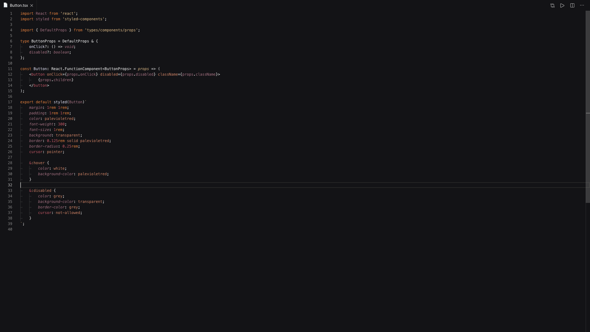
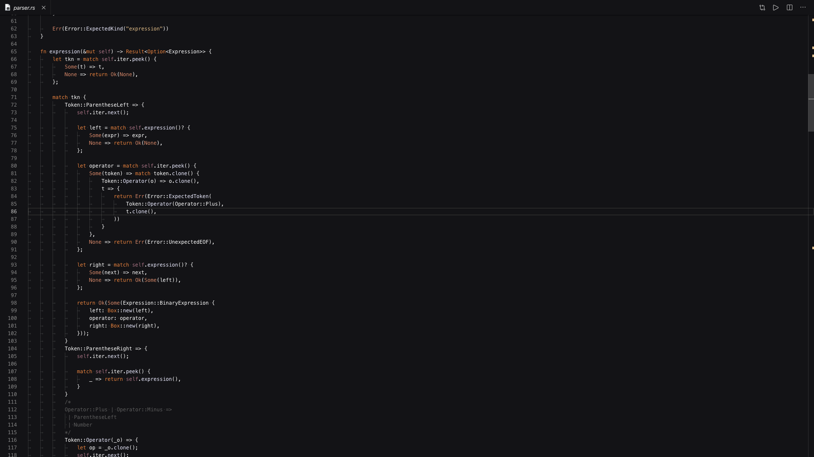
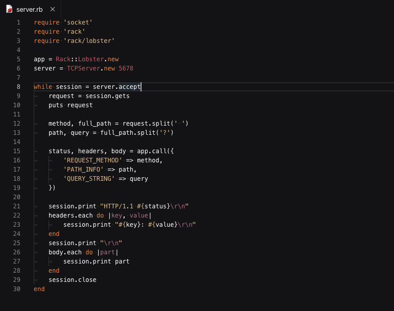

# Orion Dark


---

 <br />
A beautiful darkish theme for Visual Studio Code.

## Installation

press `ctrl/command + shift + p` to launch the command palette and then run

```
ext install one-monokai
```

## Screenshots

#### JavaScript / TypeScript



#### Rust



#### Ruby



#### C


