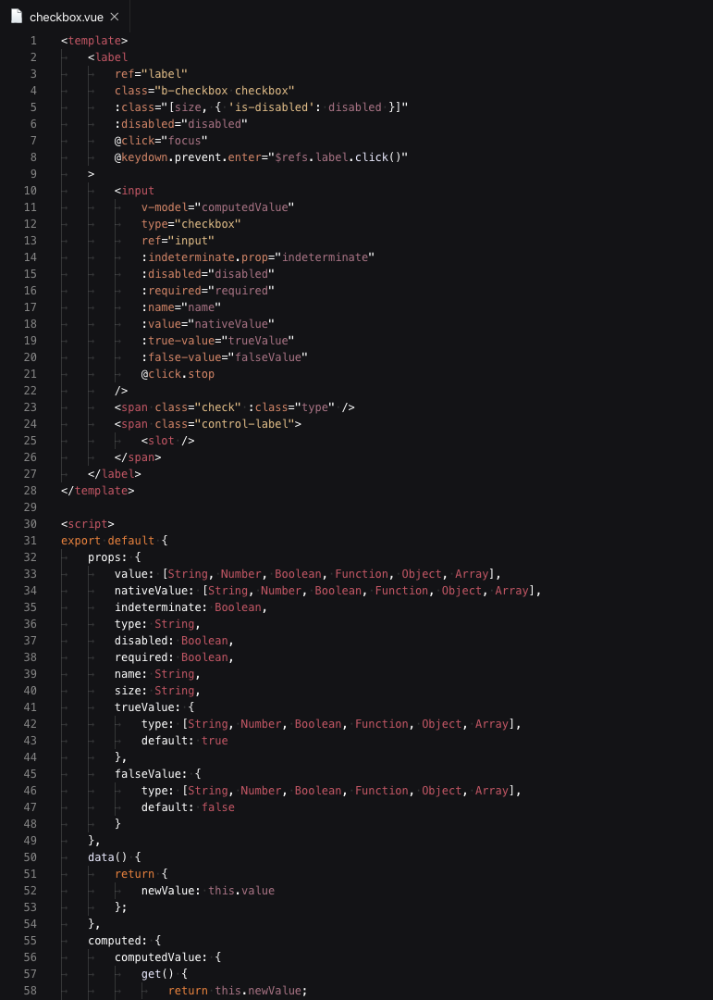
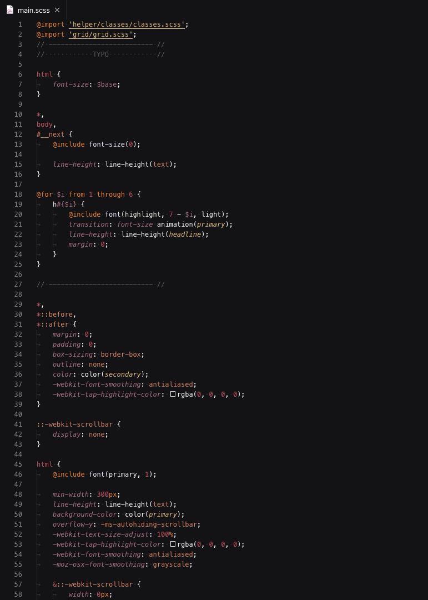
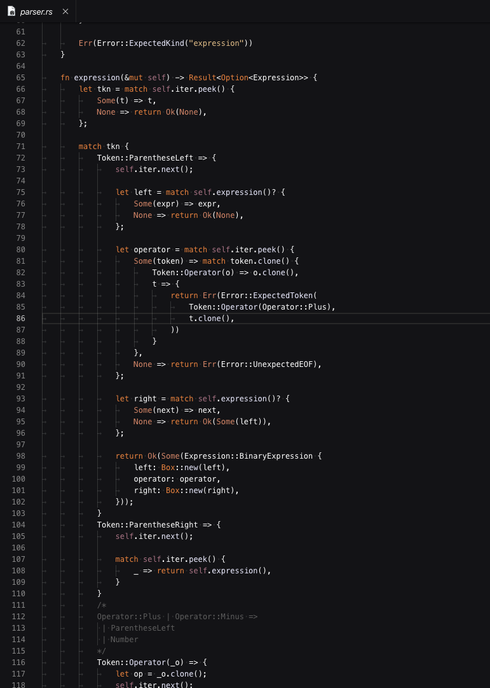
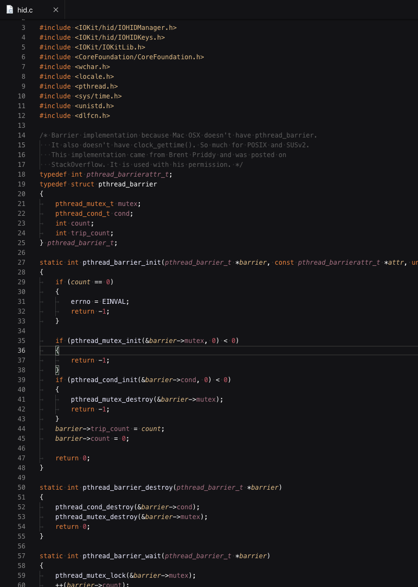

# Orion Dark

 <br />
A beautiful darkish theme for Visual Studio Code.


---

## Installation

press `ctrl/command + shift + p` to launch the command palette and then run

```
ext install orion
```

## Screenshots

#### JavaScript / TypeScript


#### Vue



#### Scss



#### Rust



#### Ruby


#### C


